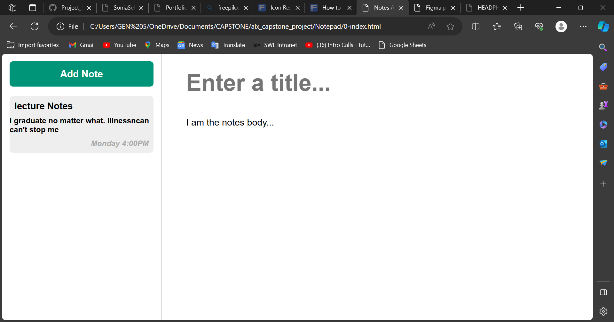

Notepad Website

Welcome to Notepad Website, a simple and intuitive online notepad application that allows you to jot down notes, ideas, and tasks quickly. This web-based notepad is designed for simplicity and ease of use, making it a perfect tool for organizing your thoughts on the go.

Features

Easy to Use: Minimalistic and user-friendly interface for effortless note-taking.
Cross-Platform: Access your notes from any device with an internet connection.
Save and Retrieve: Save your notes in real-time, ensuring you never lose important information.
Customization: Personalize your notepad with different themes and font options.

 How to Use

1. Create a Note: Click on the "New Note" button to create a new note.
2. Edit: Start typing your note in the provided text area.
3. Save: Your notes are saved automatically as you type.
4. Retrieve: All your saved notes are accessible in the sidebar. Click on a note to edit or view it.
5. Customize: Explore the settings menu to customize the appearance of your notepad.

Technologies Used

Frontend: HTML, CSS, JavaScript

 Installation

This is a web-based application, and no installation is required. Simply open the website in your preferred web browser and start taking notes.

Contributing

If you'd like to contribute to the development of this Notepad Website, please follow these steps:

1. Fork the repository on GitHub.
2. Clone your forked repository to your local machine.
3. Create a new branch to work on a new feature or bug fix.
4. Make your changes, commit them, and push your changes to your fork.
5. Submit a pull request to the original repository.
License

This Notepad Website is licensed under the [MIT License](LICENSE.md).
link : [link](https://github.com/Sonia226/alx_capstone_project/tree/main/Notepad)
