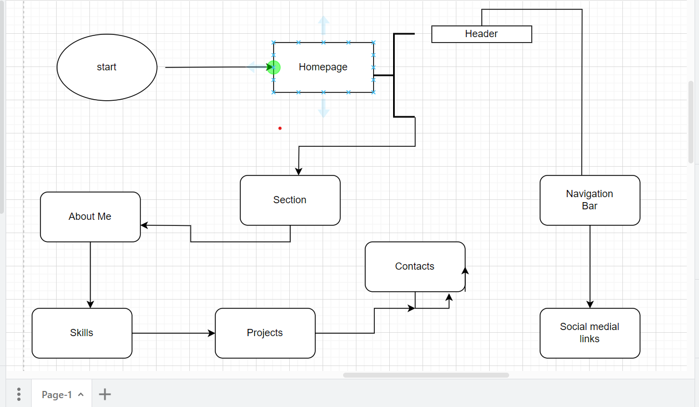

Sonia's Portfolio

Project Overview:

My personal portfolio website is a showcase of my skills, projects, and experiences as a developer. Its purpose is to provide visitors with an overview of my expertise, the projects I have worked on, and the technologies I am proficient in. The goal is to create a professional online presence, allowing potential employers, clients, and collaborators to learn more about my work and get in touch with me easily.

Features and Functionality:

Home Page: Introduces visitors to my profile with a brief overview and a welcoming message.
Projects: Displays a curated selection of my projects with descriptions, technologies used, and links to GitHub repositories or live demos.
Skills: Lists the programming languages, frameworks, and tools I am proficient in.
Contact: Provides a contact form for visitors to reach out to me directly.
Responsive Design: Ensures optimal viewing experience across various devices, including desktops, tablets, and smartphones.

Technologies Used:

Frontend: HTML, CSS, JavaScript
Version Control: Git, GitHub for project repository.

Flowchart for the Project

 Screenshots:

 Live Demo:
[Click here to view the live demo](link_to_live_demo)

 Roadmap and Future Enhancements:

Blog Section: Add a blog section to share my thoughts, tutorials, and insights related to technology and programming.

Interactive Resume: Provide an interactive resume download feature for visitors.

Integration with APIs: Incorporate APIs to showcase real-time data or dynamic content related to my skills or interests.

Multimedia Portfolio: Expand the portfolio to include multimedia projects, such as videos, animations, or interactive applications.

Performance Optimization: Optimize website performance by minifying CSS and JavaScript files, as well as optimizing images.

Education:
ALX Student.
  
Contact Information:
Sonia Selikem Tsekpodoe
Email: tsekpodoesoniaselikem@gmail.com

LinkedIn: [ My LinkedIn Profile](https://www.linkedin.com/in/SoniaSelikemSoftwareEngineer)

GitHub: [My GitHub Profile](https://github.com/Sonia226)

Personal Website: [My Personal Portfolio Website](https://www.yourwebsite.com)

Contact and Whatsapp: 0247429280